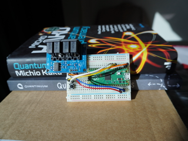

# Quantum MIDI

This is a very simple example that performs two things using the [micro-qsim](https://github.com/Quantum-Village/micro-quantum) library QV released in 2022. 

This will build in the usual way with the `pico-sdk` for the Rasspberry Pi Pico:

```bash
mkdir build
cmake ..
make
```

This particular version has several interrupts. The interrupt for the button will generate a simulation with lots of outputs that become the input parameters for the oscillators in the DX. The UART interrupt allows notes to be read , pass the note value to a quantum simulator, and then read the response and send it as a new MIDI note. 

MIDI is a very simple protocol (3 byte messages at 31.25k speed, 8N1), so it is implemented manually here.

## Wiring

The wiring is really simple - 

* connect the switch to pins 7 and 8 (GPIO5 and GND)
* Connect the power for the MIDI board to pins 36 and 38 (3V3 OUT and GND)
* Connect the MIDI OUT pin on the MIDI board to pin 1 on the Pico (GP0)
* Connect the MIDI IN pin on the MIDI board to pin 2 on the Pico (GP1)
* power comes from the USB port

Here's a picture of the setup used at DEF CON:


